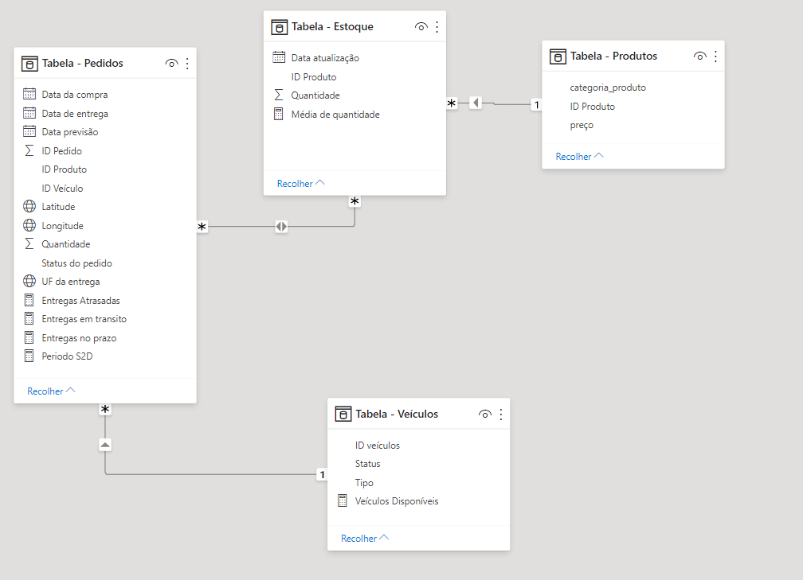
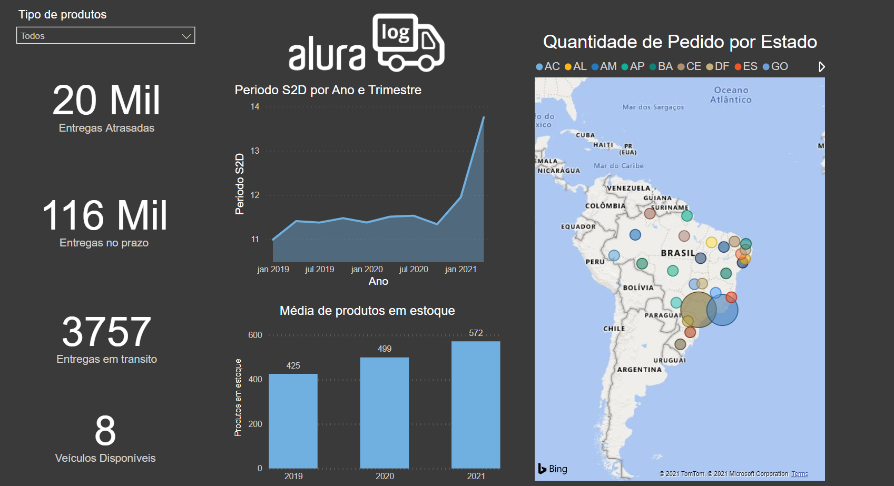
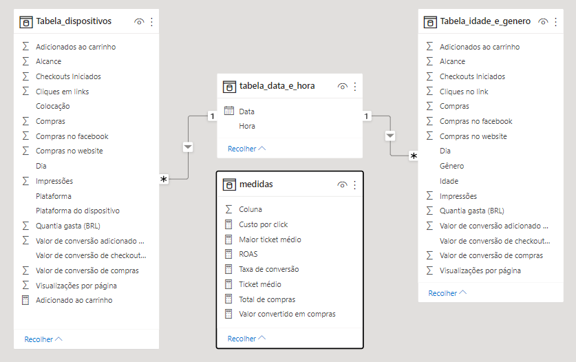

# alura-challenges-powerBi


## Primeira semana: Desafio Logístico

Na primeira semana deste projeto, recebemos um banco de dados de uma empresa de varejo. As tarefas iniciais eram trabalhar sobre os dados e formatá-los para que pudessem ser utilizados.

Um exemplo da transformações de dados:


Alguma das medidas usadas:

* Visualização da média da quantidade:

1. Para visualização foi necessario tratamento atráves do Power Query para tratar os dados:


2. Visto que é a formatação é americana então foi necessario alterar apenas a localidade dos dados:


3. E como resultado:


4. E agora podemos utilizar a medida:

    ```
    Média de quantidade = AVERAGEX('Tabela - Estoque', [Quantidade])  
    ```


*  Iterar sobre as linhas para calcular a média mensal:
   
   ```
    Periodo médio de entrega-S2D (dias) = AVERAGEX(
        'Tabela - Pedidos', 
        'Tabela - Pedidos'[Periodo de entrega-S2D (dias)
    )  
    ```
 
* Filtro de entregas que estão atrasadas: 

    ```
    Entregas Atrasadas = CALCULATE(
        COUNTROWS('Tabela - Pedidos'),
        FILTER(
            'Tabela - Pedidos', 
            'Tabela - Pedidos'[Data de entrega] > 'Tabela - Pedidos'[Data previsão]
        )
    )
    ```
    
* Filtro de entregas no prazo:

    ```
    Entregas no prazo = CALCULATE(
        COUNTROWS('Tabela - Pedidos'),
        FILTER(
            'Tabela - Pedidos', 
            'Tabela - Pedidos'[Data de entrega] < 'Tabela - Pedidos'[Data previsão] && 'Tabela - Pedidos'[Status do pedido] = "Entregue"
        )
    )
    ```
    
* Periodo S2D:

    ```
    Periodo S2D = AVERAGEX('Tabela - Pedidos','Tabela - Pedidos'[Data de entrega] - 'Tabela - Pedidos'[Data da compra])
    ```
Relacionamento das tabelas:


  
## Resultado da Dashboard:


  
## Link da Dashboard Logistíca:
https://app.powerbi.com/reportEmbed?reportId=d47281b5-ef71-4a0d-b6ed-9d81dd1b3e74&autoAuth=true&ctid=da49a844-e2e3-40af-86a6-c3819d704f49&config=eyJjbHVzdGVyVXJsIjoiaHR0cHM6Ly93YWJpLWJyYXppbC1zb3V0aC1yZWRpcmVjdC5hbmFseXNpcy53aW5kb3dzLm5ldC8ifQ%3D%3D


## Segunda semana: Desafio Marketing
Este conteúdo foi desenvolvido durante no evento "Alura Challenges" , onde temos contato adquirimos experiência com assuntos relacionados com a nossa área de Data Science em BI. 

O foco nessa semana foi em métricas.


## Tratamento de Dados

Não foi necessário realizar o tratamento dos dados

## Métricas 

* CPC (Custo por click)
* Ticket Médio por dispositivos
* ROAS (Retorno sobre ativos)
* Total de compras 
* Valor investido na campanha total
* Total de valor convertido em compras
* Valor convertido em compras por dia
* Taxa de conversao em compras 

## Relacionamentos


## Algumas medidas:

*  CPC:

```

Custo por click = divide(
sum(Tabela_idade_e_genero[Quantia gasta (BRL)]),
SUM(Tabela_idade_e_genero[Cliques no link])
)

```

*  Valor convertido em compras: 
```

Valor convertido em compras = sum (Tabela_idade_e_genero[Valor de conversão de compras])

```

* ROAS:
```

ROAS = sum(Tabela_idade_e_genero[Valor de conversão de compras])/SUM(Tabela_idade_e_genero[Quantia gasta (BRL)])

```
* Taxa de conversão de click em compras (%):
```

Taxa de conversão = sum(Tabela_idade_e_genero[Compras])/sum(Tabela_idade_e_genero[Visualizações por página])

```

## Link para Dashboard

https://app.powerbi.com/reportEmbed?reportId=3525c5ad-c48e-42e6-a046-94f220c402dc&autoAuth=true&ctid=da49a844-e2e3-40af-86a6-c3819d704f49&config=eyJjbHVzdGVyVXJsIjoiaHR0cHM6Ly93YWJpLWJyYXppbC1zb3V0aC1yZWRpcmVjdC5hbmFseXNpcy53aW5kb3dzLm5ldC8ifQ%3D%3D

## imagem da Dashboard


