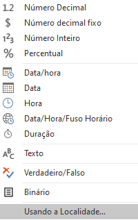
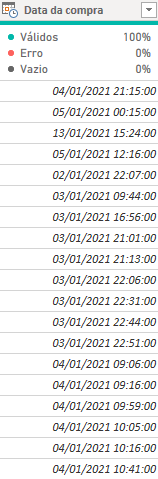

# alura-challenges-powerBi


## Primeira semana: Desafio Logístico

Na primeira semana deste projeto, recebemos um banco de dados de uma empresa de varejo. As tarefas iniciais eram trabalhar sobre os dados e formatá-los para que pudessem ser utilizados.

Um exemplo da transformações de dados:


Alguma das medidas usadas:

* Visualização da média da quantidade:

1. Para visualização foi necessario tratamento atráves do Power Query para tratar os dados:


2. Visto que é a formatação é americana então foi necessario alterar apenas a localidade dos dados:



3. E como resultado:



4. E agora podemos utilizar a medida:

    ```
    Média de quantidade = AVERAGEX('Tabela - Estoque', [Quantidade])  
    ```


*  Iterar sobre as linhas para calcular a média mensal:
   
   ```
    Periodo médio de entrega-S2D (dias) = AVERAGEX(
        'Tabela - Pedidos', 
        'Tabela - Pedidos'[Periodo de entrega-S2D (dias)
    )  
    ```
 
* Filtro de entregas que estão atrasadas: 

    ```
    Entregas Atrasadas = CALCULATE(
        COUNTROWS('Tabela - Pedidos'),
        FILTER(
            'Tabela - Pedidos', 
            'Tabela - Pedidos'[Data de entrega] > 'Tabela - Pedidos'[Data previsão]
        )
    )
    ```
    
* Filtro de entregas no prazo:

    ```
    Entregas no prazo = CALCULATE(
        COUNTROWS('Tabela - Pedidos'),
        FILTER(
            'Tabela - Pedidos', 
            'Tabela - Pedidos'[Data de entrega] < 'Tabela - Pedidos'[Data previsão] && 'Tabela - Pedidos'[Status do pedido] = "Entregue"
        )
    )
    ```
    
* Periodo S2D:

    ```
    Periodo S2D = AVERAGEX('Tabela - Pedidos','Tabela - Pedidos'[Data de entrega] - 'Tabela - Pedidos'[Data da compra])
    ```
Relacionamento das tabelas:


   
